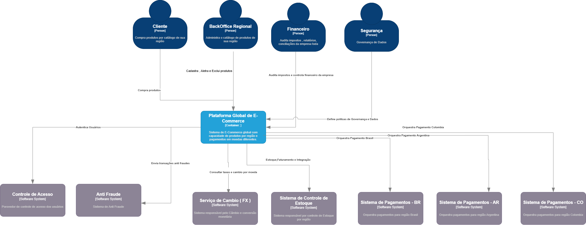
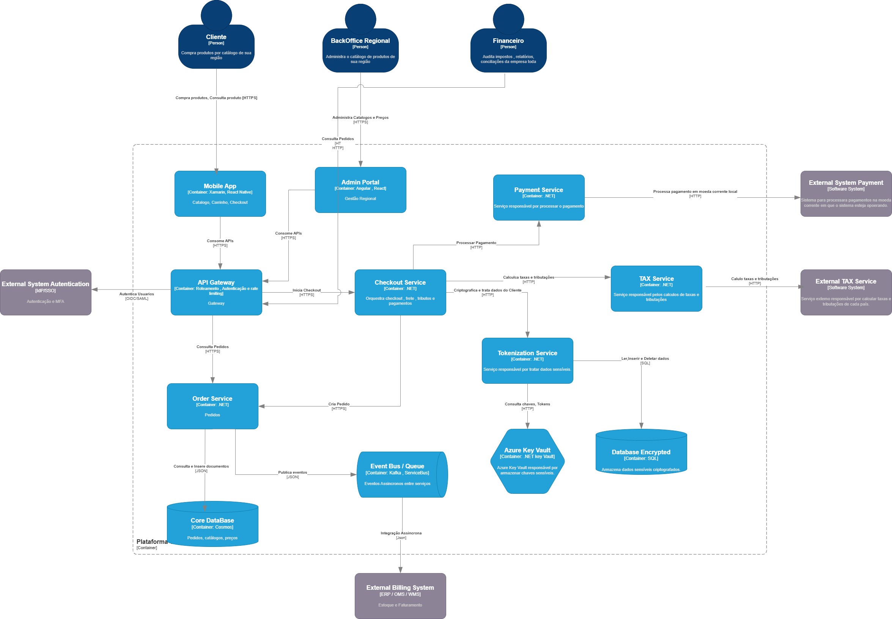

# Arquitetura – E-commerce Multinacional

## Visão Geral

Este projeto descreve a arquitetura de uma plataforma de **e-commerce multinacional** operando em:

- Brasil
- Argentina
- Colômbia

A solução precisa suportar:

- regras fiscais distintas por país
- múltiplas moedas
- métodos de pagamento locais
- proteção de dados pessoais
- personalização regional de catálogo
- consistência de dados entre sistemas distribuídos

A arquitetura foi projetada utilizando **serviços cloud escaláveis e seguros no Azure**, garantindo resiliência, segurança e capacidade de expansão internacional.

---

# Diagrama de Contexto

O diagrama de contexto apresenta a visão macro do sistema, mostrando os principais atores externos e como eles interagem com a plataforma.

Inclui:

- Clientes
- Sistemas de pagamento
- Serviços fiscais
- Plataforma de e-commerce
- Sistemas internos

### Diagrama

---

# Diagrama de Container

O diagrama de container apresenta os principais componentes internos da arquitetura e como eles se comunicam.

Elementos principais:

- API Gateway
- Microservices
- Azure Service Bus
- Cosmos DB
- Banco de dados criptografado
- Azure Key Vault
- APIs externas

### Diagrama

---

# Decisões Arquiteturais (ADR)

A arquitetura foi construída utilizando os seguintes componentes:

- API Gateway
- Azure Key Vault
- Cosmos DB
- Banco de dados criptografado
- Comunicação via APIs HTTP
- Azure Service Bus

## API Gateway

O **API Gateway** centraliza o acesso aos serviços da plataforma.

Principais responsabilidades:

- autenticação e autorização
- roteamento de requisições
- versionamento de APIs
- aplicação de políticas de segurança
- monitoramento e controle de acesso

Isso reduz o acoplamento entre clientes e serviços internos.

---

## Azure Key Vault

O **Azure Key Vault** é utilizado para armazenar:

- segredos
- chaves criptográficas
- certificados
- credenciais de integração

Essa abordagem evita exposição de credenciais em código ou configurações e melhora a governança de segurança da aplicação.

---

## Cosmos DB

O **Cosmos DB** foi escolhido para armazenar dados com estruturas flexíveis, como:

- catálogo de produtos
- configurações regionais
- regras fiscais
- dados de personalização por país

Benefícios:

- escalabilidade horizontal
- baixa latência
- distribuição geográfica
- alta disponibilidade

---

## Banco de Dados Criptografado

Um banco de dados criptografado é utilizado para armazenar dados sensíveis como:

- informações de clientes
- pedidos
- transações financeiras

A criptografia protege os dados **em repouso**, atendendo requisitos de segurança e conformidade regulatória.

---

## Comunicação via APIs HTTP

Os sistemas internos e externos se comunicam através de **APIs HTTP**.

Isso permite:

- interoperabilidade entre sistemas
- integração com gateways de pagamento
- integração com serviços fiscais
- padronização de contratos de comunicação

---

## Azure Service Bus

O **Azure Service Bus** é utilizado para comunicação assíncrona entre serviços.

Ele permite:

- desacoplamento entre sistemas
- maior resiliência
- processamento assíncrono de eventos
- melhor escalabilidade

Exemplos de uso:

- processamento de pedidos
- atualização de estoque
- notificações
- integração com sistemas externos

---

# Trade-offs da Arquitetura

Toda decisão arquitetural envolve **trade-offs**, ou seja, ganhos em alguns aspectos e limitações em outros.

## Cosmos DB

Benefícios:

- alta escalabilidade
- flexibilidade de schema
- distribuição global

Trade-offs:

- custo maior em comparação a bancos tradicionais
- consultas complexas podem exigir modelagem específica

---

## Arquitetura baseada em filas

Benefícios:

- desacoplamento entre serviços
- maior tolerância a falhas
- melhor escalabilidade

Trade-offs:

- processamento assíncrono
- maior complexidade de rastreamento de eventos

---

## API Gateway

Benefícios:

- centralização de segurança
- controle de acesso
- simplificação da exposição de APIs

Trade-offs:

- possível ponto de gargalo se mal configurado
- necessidade de governança e monitoramento adequado

---

# Conclusão

A arquitetura proposta busca equilibrar:

- **segurança**
- **escalabilidade**
- **flexibilidade**
- **resiliência**

Essas características são essenciais para suportar operações de e-commerce em múltiplos países com diferentes exigências regulatórias e operacionais.